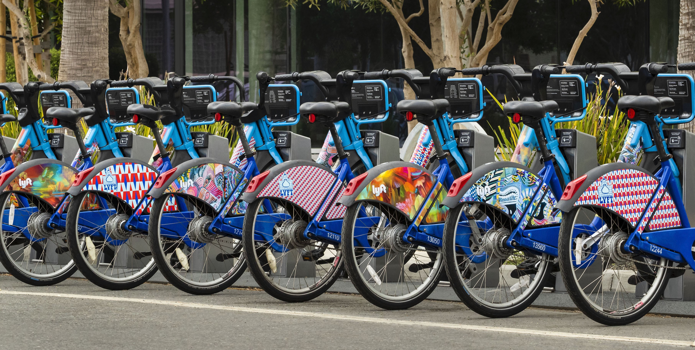

**Important note**: If you get the message "Sorry, something went wrong. Reload?" when viewing an *.ipynb - try to open that notebook using nbviewer online, here is the link:
 - https://nbviewer.jupyter.org/github/loudlemon/Bay-Wheels-exploration/blob/master/exploration_WHEEL_BIKE.ipynb \
This site nbviewer works independently of github.

# Bay Wheels sharing system. Explore and analize
## Data
Bay Wheels is a regional public bicycle sharing system in the San Francisco Bay Area, 
California operated by Motivate in a partnership with the Metropolitan Transportation 
Commission and the Bay Area Air Quality Management District. Bay Wheels is the first 
regional and large-scale bicycle sharing system deployed in California and on the West 
Coast of the United States. It was established as Bay Area Bike Share in August 2013. 
As of January 2018, the Bay Wheels system had over 2,600 bicycles in 262 stations across 
San Francisco, East Bay and San Jose. After Motivate's acquisition by Lyft, the system 
was subsequently renamed to Bay Wheels in June 2019. This dataset is 12-month ride trips
from 2019.

### Some of the transformations and changes:
 - merge all 12 parts in one entire dataset
 - check all .dtypes and cast to appropriate where needed
 - add new columns for trip duration in minutes, trip start date in yyyy-mm-dd format, 
   trip start hour of the day, day of week and month
 - fill NaNs in columns `start_statiom_name`,`end_station_name`
 - some outliers haven't been removed due to minor change in total score
 
 ### Summary
 In the dataset represented number of user types varies in favour of Subscribers, people 
 in this group tend to rent bikes all year round, probably they have annual subscription, that is they
 use bikes every day, and according to visuals, to get ot their job, mostly from ordinary
 stations to train stations and vice verse when going back home. Travel for a short distances
 day to day for the whole year with slightly prolonged duration on weekdays - that is a behavoir 
 of subscribers.
 Whereas Customers are different. They use bikes to get around, explore the area, 
 a lot of turists among them,I suppose. The interseting fact is that people in this 
 group tend to rent a bike (on average) for a longer time during the whole year, 
 despite the fact that their number is twice as much as lower then in Subscribers group.
 
 ### Key insights
 - Subscribers use bikes during their way to work and vice versa wen going back.
   Because of that we can observe rush ours in the morning (7-10) and in the evening(16-19)
 - Customers use bikes during weekend, on work days the number of occurences in Customers group
   is very low comparing to Subscribers group
 - Subscribers are twice as many as Customers, but  mean time for Customers is twice as many as
   for Subscribers
 - During weekend mean time increases in both groups
 - Bike sharing in demand for a whole year, except for December
 - Record of bike rent time was about 10 days and belonged to customer

